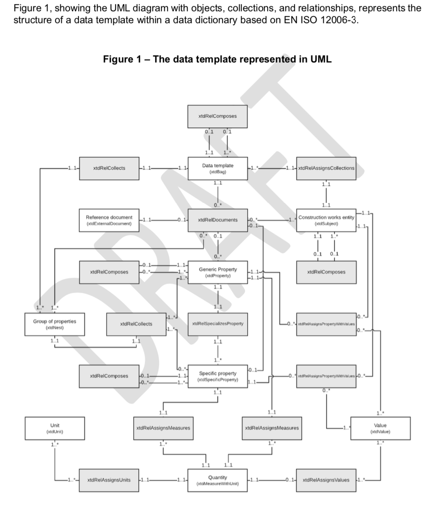
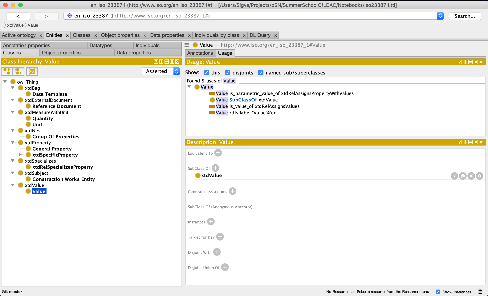

# EN ISO 23387 ontology test

This work was done as part of a code challenge on *Integrating heterogeneous Building Product Data* [Original Notebook](https://github.com/linkedbuildingdata/SummerSchoolOfLDAC/blob/master/Notebooks/02-01-Integrate-heterogeneous-building-product-data.ipynb) and [Accompanying presentation](https://github.com/linkedbuildingdata/SummerSchoolOfLDAC/blob/master/presentations/06_Wagner_LinkedBuildingProducts.pdf)

The repository contains a test on programmatically creating an ontology for EN ISO 23387-1 based on ISO 12006-3 ontology using python. Schematically presented here:



The ISO12006-3 ontology could be found in the ont folder, in .ttl format. This and the resulting EN ISO 23387-1 ontology (also .ttl) could be viewed and edited in eg. Protegé as showed in the image below




## How to use the code in the Repository
This project uses python 3 and jupyter notebooks. For working with the ontology the RDFLib library is used.

The [environment.yml](environment.yml). Install anaconda on your machine [create environment from this file](https://docs.conda.io/projects/conda/en/latest/user-guide/tasks/manage-environments.html#creating-an-environment-from-an-environment-yml-file). After you can activate it by source activate {name of environment} and start the notebooks by ```jupyter notebook``` in the repo root.

## How to contribute
Please add an issue with ideas or comments, and feel free to add pull requests with alterations.

## File result
Please see the ontology files as result of the script in the ```ont``` folder.

It could be viewed and edited in eg. [Protegé downloadable here](https://protege.stanford.edu/)
